# Orange Studies — Complete Site Map & Page Linking Guide

> **Version:** v1.5.1 · **Routes:** 24 pages · **Components:** 46 · **Last Updated:** Feb 27, 2026

---

## Route Overview

```mermaid
graph TD
    subgraph Public["🌐 Public Pages"]
        HOME["/"]
        ABOUT["/about"]
        BLOG["/blog"]
        CONTACT["/contact"]
        PROGRAMS["/programs"]
        INSTITUTIONS["/institutions"]
        RECRUITERS["/recruiters"]
        STORIES["/success-stories"]
        SEARCH["/search"]
        PRIVACY["/privacy"]
        TERMS["/terms"]
    end

    subgraph StudyAbroad["📚 Study Abroad"]
        SA["/study-abroad"]
        GUIDES["/study-abroad/country-guides"]
        COUNTRY["/study-abroad/country-guides/[country]"]
        COSTS["/study-abroad/cost-scholarships"]
        CHECKLIST["/study-abroad/application-checklist"]
        SOP["/study-abroad/sop-visa-guides"]
        FAQS["/study-abroad/faqs"]
    end

    subgraph Dynamic["🔗 Dynamic Detail Pages"]
        UNI_DETAIL["/institutions/[slug]"]
        PROG_DETAIL["/programs/[slug]"]
        APPLY["/apply/[programId]"]
    end

    subgraph Auth["🔒 Auth & Portals"]
        LOGIN["/login"]
        ADMIN_LOGIN["/admin/login"]
        DASHBOARD["/dashboard/student"]
    end

    subgraph API["⚡ API"]
        AUTH_API["/api/auth/[...nextauth]"]
    end

    PROGRAMS --> PROG_DETAIL
    PROG_DETAIL --> APPLY
    APPLY --> DASHBOARD
    INSTITUTIONS --> UNI_DETAIL
    UNI_DETAIL --> PROG_DETAIL
    GUIDES --> COUNTRY
    LOGIN --> DASHBOARD
    ADMIN_LOGIN --> LOGIN
    DASHBOARD --> PROGRAMS
    DASHBOARD --> LOGIN
```

---

## All Pages (24 Routes)

### 🌐 Public Marketing Pages (11)

| Route | Type | Template | Links To |
|-------|------|----------|----------|
| `/` | Static | Homepage (Hero + sections) | `/programs`, `/study-abroad`, `/blog`, `/contact`, `/about`, `/success-stories` |
| `/about` | Static | About page (Hero, Mission, Team, Timeline) | — |
| `/blog` | Static | Blog listing grid | — |
| `/contact` | Static | Contact form + info | — |
| `/programs` | Static | Program listing with filters | `/programs/[slug]`, `/contact` |
| `/institutions` | Static | University listing grid | `/institutions/[slug]` |
| `/recruiters` | Static | Recruiter partner page | — |
| `/success-stories` | Static | Student testimonials | `/study-abroad#consultation` |
| `/search` | Static | Advanced search (Adventus-style filters) | `/programs/[slug]`, `/institutions/[slug]` |
| `/privacy` | Static | Privacy policy | — |
| `/terms` | Static | Terms of service | — |

### 📚 Study Abroad Section (7)

| Route | Type | Template | Links To |
|-------|------|----------|----------|
| `/study-abroad` | Static | Overview hub | `/study-abroad/country-guides`, `/study-abroad/cost-scholarships` |
| `/study-abroad/country-guides` | Static | Country grid (CountryGuidesHero) | `/study-abroad/country-guides/[country]` |
| `/study-abroad/country-guides/[country]` | SSG | Country detail (CountryDetailView) | `/study-abroad/country-guides`, `/study-abroad#self-evaluation` |
| `/study-abroad/cost-scholarships` | Static | Cost & scholarship info | — |
| `/study-abroad/application-checklist` | Static | Checklist guide | — |
| `/study-abroad/sop-visa-guides` | Static | SOP & visa guides | — |
| `/study-abroad/faqs` | Static | FAQ accordion | — |

### 🔗 Dynamic Detail Pages (3)

| Route | Type | Template | Links To |
|-------|------|----------|----------|
| `/institutions/[slug]` | Dynamic | University detail (parallax hero, tabs) | `/institutions`, `/programs/[slug]` |
| `/programs/[slug]` | Dynamic | Program detail (modules, requirements, sticky CTA) | `/programs`, `/apply/[slug]` |
| `/apply/[programId]` | Dynamic | 4-step application wizard | `/programs`, `/dashboard/student` |

### 🔒 Auth & Portal Pages (3)

| Route | Type | Template | Links To |
|-------|------|----------|----------|
| `/login` | Static | Student login (Sign In / Create Account toggle) | `/`, `/admin/login`, → `/dashboard/student` |
| `/admin/login` | Static | Admin/Manager login (dark theme) | `/`, `/login`, → `/dashboard/admin` |
| `/dashboard/student` | Static | Student dashboard (sidebar, app tracker, docs, profile) | `/`, `/login`, `/programs` |

---

## Global Components (always present)

| Component | File | Links To | Notes |
|-----------|------|----------|-------|
| **Navbar** | `layout/Navbar.tsx` | `/`, `/about`, `/programs`, `/study-abroad` (+ 5 dropdown items), `/success-stories`, `/blog`, `/contact` | Hidden on `/login`, `/admin`, `/dashboard` routes |
| **Footer** | `home/Footer.tsx` | `/about`, `/success-stories`, `/blog`, `/contact`, `/programs`, `/study-abroad` (+ 5 sub-pages), `/recruiters`, `/institutions`, `/privacy`, `/terms` | Hidden on portal routes |
| **WhatsApp FAB** | `layout/WhatsAppFAB.tsx` | External WhatsApp link | Floating button |
| **ScrollToTop** | `home/ScrollToTop.tsx` | — | Scroll-to-top button |

---

## Component Inventory (46 total)

### Homepage Components (17)
| Component | Used On |
|-----------|---------|
| `HeroParticleMap.tsx` | Homepage (active hero) |
| `ValueProps.tsx` | Homepage |
| `HowItWorks.tsx` | Homepage |
| `FeaturedDestinations.tsx` | Homepage |
| `StatsFloating.tsx` | Homepage |
| `UniversityLogos.tsx` | Homepage |
| `WhyOrangeStudies.tsx` | Homepage |
| `Testimonials.tsx` | Homepage |
| `FAQSection.tsx` | Homepage |
| `BlogPreview.tsx` | Homepage → `/blog` |
| `CTABanner.tsx` | Homepage, detail pages → `/contact` |
| `GlobalSearch.tsx` | Not integrated (orphaned) |
| `StickyMobileCTA.tsx` | Homepage → `/get-started` ⚠️ dead link |
| `SocialProofTicker.tsx` | Orphaned |
| `HeroPortal.tsx` | Orphaned |
| `Hero.tsx` / `HeroSection.tsx` / `HeroBackground.tsx` / `HeroContent.tsx` | Orphaned (replaced by HeroParticleMap) |

### About Components (6)
| Component | Used On |
|-----------|---------|
| `AboutHero.tsx` | `/about` |
| `MissionVision.tsx` | `/about` |
| `OurValues.tsx` | `/about` |
| `StatsStrip.tsx` | `/about` |
| `TeamSection.tsx` | `/about` |
| `Timeline.tsx` | `/about` |

### Study Abroad Components (11)
| Component | Used On |
|-----------|---------|
| `StudyAbroadHero.tsx` | `/study-abroad` |
| `StudyAbroadProcess.tsx` | `/study-abroad` |
| `StudyAbroadResources.tsx` | `/study-abroad` |
| `CountryGuidesHero.tsx` | `/study-abroad/country-guides` |
| `CountryDetailView.tsx` | `/study-abroad/country-guides/[country]` |
| `countryData.tsx` | Data file for country guides |
| `ConsultationBooking.tsx` | `/study-abroad` |
| `SelfEvaluation.tsx` | `/study-abroad` |
| `SOPGuide.tsx` | `/study-abroad/sop-visa-guides` |
| `SOPVisaHero.tsx` | `/study-abroad/sop-visa-guides` |
| `VisaGuides.tsx` | `/study-abroad/sop-visa-guides` |

### UI Primitives (5)
| Component | Used On |
|-----------|---------|
| `LogoIcon.tsx` | Navbar, login pages, dashboard |
| `Button.tsx` | General use |
| `SectionHeading.tsx` | Section titles |
| `AnimatedCounter.tsx` | Stats sections |
| `DocumentDropzone.tsx` | `/apply/[programId]` step 2 |

---

## User Flow Diagram

```mermaid
flowchart LR
    A["🏠 Homepage"] --> B["📚 Programs Listing"]
    B --> C["📄 Program Detail"]
    C --> D["📝 Apply Wizard"]
    D --> E["✅ Success"]
    E --> F["📊 Student Dashboard"]

    A --> G["🌍 Study Abroad"]
    G --> H["🗺️ Country Guides"]
    H --> I["🇬🇧 Country Detail"]

    A --> J["🏛️ Institutions"]
    J --> K["🏛️ University Detail"]
    K --> C

    L["🔐 Login"] --> F
    M["🔐 Admin Login"] --> N["Admin Dashboard (future)"]
```

---

## ⚠️ Dead Links & Issues

| Source | Link Target | Issue |
|--------|-------------|-------|
| `StickyMobileCTA.tsx` | `/get-started` | **Page doesn't exist** |
| `Footer.tsx` social links | `#` | Placeholder `#` links |
| `BlogPreview.tsx` "Read More" | `/blog` | Links to listing, not individual posts |
| `Navbar.tsx` | Missing links to `/login`, `/search`, `/institutions` | Not in nav items |

---

## Middleware / Auth Protection

| Protected Routes | Behavior |
|-----------------|----------|
| `/dashboard/*` | Requires auth token (redirects to `/login` if unauthenticated) |
| `/apply/*` | Requires auth token |
| `/dashboard/admin` | Requires `ADMIN` or `MANAGER` role (redirects to `/dashboard/student` otherwise) |
